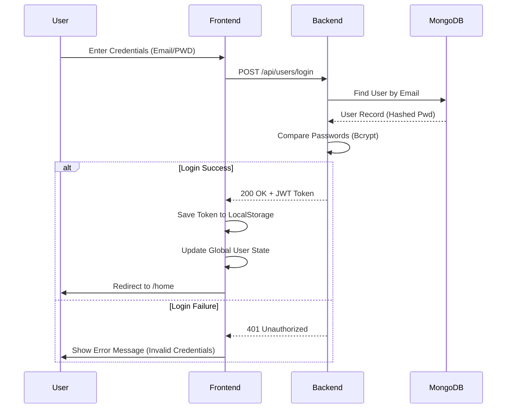
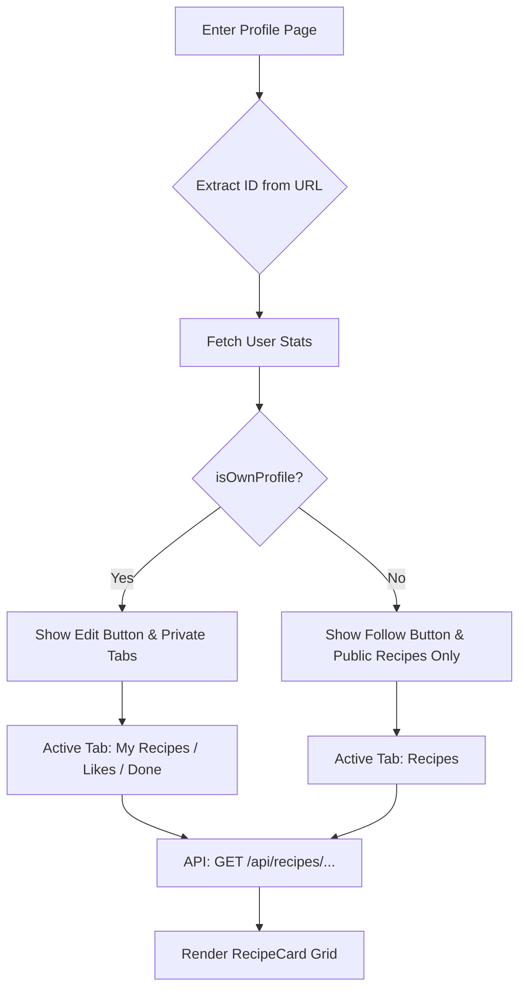
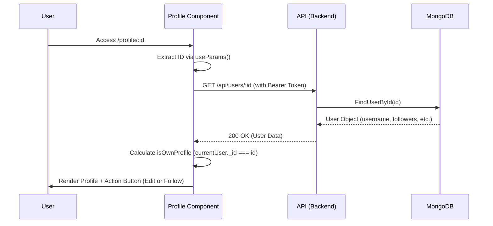

# 🍳 Recipe Social Network - Technical Documentation

## Project Overview
A specialized **MERN stack** application designed for chefs to share recipes and manage culinary identities. This project focuses on a **Component-Based Architecture** and **Categorized Tagging Systems**.

---

## 1. Authentication Module (Login & Register)
**Description:** This module manages secure user access and account creation. It ensures that only verified chefs can interact with protected features like profile editing and recipe creation.

### 1.1. Technical Specifications
* **Frontend:** Built with **React & TypeScript**, utilizing **Axios** for API communication.
* **State Management:** Uses a central `setUser` hook to synchronize user data across the application.
* **Security:** * **JWT (JSON Web Tokens):** Used for session validation and secure API access.
    * **Bcrypt:** Handles password hashing on the backend to ensure data privacy.
    * **Persistence:** Implements **LocalStorage** to maintain the session after a page refresh (F5).
    * **UX Features:** Includes a **Password Visibility Toggle** (Eye icon) and real-time **Password Matching** verification.
### 1.2. Diagrams
#### 1.2.1. Authentication Sequence Diagram
This diagram illustrates the secure handshake between the **User**, **Frontend**, **Backend**, and **Database**:


#### 1.2.2. Activity Diagram
````mermaid
graph TD
    Start[User enters Auth Page] --> Choice{Login or Register?}
    
    Choice -- Register --> RegForm[Fill Username, Email, Password]
    RegForm --> Match{Passwords Match?}
    Match -- No --> Error1[Show 'Passwords do not match']
    Match -- Yes --> PostReg[API: POST /api/users/register]
    
    Choice -- Login --> LogForm[Fill Email, Password]
    LogForm --> PostLog[API: POST /api/users/login]
    
    PostReg & PostLog --> Response{API Success?}
    Response -- No --> Error2[Show Error Message from Backend]
    Response -- Yes --> JWT[Save JWT to LocalStorage]
    JWT --> GlobalState[Update setUser State]
    GlobalState --> Home[Redirect to /home]
````


### 1.3. Frontend Logic & Functional Analysis (Auth)
**Description:** This section breaks down the core functions used in the authentication components to handle user input, state synchronization, and API communication.

#### **1.3.1. State Management Functions**
| Function Name | Location | Purpose |
| :--- | :--- | :--- |
| `handleChange` | `Login` / `Register` | **Dynamic Mapping:** Updates the `formData` object using `[e.target.name]: e.target.value`. This allows a single function to handle all input fields (email, password, username). |
| `setUser` | `App.tsx` (Prop) | **Global Sync:** Updates the root state of the application. Once called, the `Navbar` and `ProtectedRoutes` immediately recognize the user as "Authenticated". |
| `setShowPassword` | `Login` / `Register` | **UX Toggle:** Swaps the boolean state to change the input type between `text` and `password`. |

#### **1.3.2. Data Processing & API Calls**
| Function Name | Type | Description |
| :--- | :--- | :--- |
| `handleSubmit` | **Async** | Prevents default form behavior, triggers the **Axios POST** request, and manages the redirection logic upon success. |
| `localStorage.setItem` | **Web API** | **Persistence:** Stores the **JWT** string in the browser's memory. This is critical for the `useEffect` hook in `App.tsx` to auto-login the user on reload. |
| `setError` | **State Hook** | **Error Catching:** Specifically handles `axios.isAxiosError` to display the exact message sent by the Backend (e.g., "User already exists"). |

---

### 1.4. Code Logic Highlight (Client-Side Validation)
In the **Register** component, we implemented a specific security check before the API call to improve **User Experience (UX)** and reduce server load:

```typescript
// Security check: Passwords must match
if (formData.password !== formData.passwordverif) {
    setError("Passwords do not match!");
    return; // Stops the execution before hitting the Backend
}
```
### 1.5. Data Dictionary (Authentication)
This section defines the data structure for user authentication, ensuring consistency between the **Frontend** state and the **Backend** database schema.

| Attribute | Data Type | Requirement | Description |
| :--- | :--- | :--- | :--- |
| `username` | **String** | Required (Reg) | Unique display name chosen by the user. |
| `email` | **String** | Required | Unique email address (must follow RFC 5322 standard). |
| `password` | **String** | Required | Hashed string (stored via **Bcrypt** on the backend). |
| `token` | **String** | Generated | **JWT** (JSON Web Token) used for session authorization. |
| `_id` | **ObjectId** | Generated | Unique identifier automatically assigned by **MongoDB**. |

---

### 1.6. API Endpoints Logic
* **POST** `/api/users/register`: Creates a new user instance in the database.
* **POST** `/api/users/login`: Validates credentials and returns a **Bearer Token**.
* **GET** `/api/users/me`: Protected route that returns the current user's data using the **JWT**.

## 2. UI Component Library (Design System)
**Description:** The application follows an **Atomic Design** approach. Reusable components are stored in `src/components/common` to ensure visual consistency and reduce code duplication.

### 2.1. Atomic Components
| Component | Props | Logic / Behavior |
| :--- | :--- | :--- |
| **Button** | `label`, `variant`, `disabled` | Dynamic CSS classes applied based on the `variant` prop (`primary`, `outline`, `google`). |
| **InputField** | `type`, `label`, `onChange` | Includes internal state `isPasswordVisible` to toggle visibility for sensitive data. |

### 2.2. Molecular Components
#### **RecipeCard**
A versatile card used across the entire platform. It adapts its UI based on the `variant` prop:
* **`feed`**: Displays the author's avatar and name.
* **`my-profile`**: Removes the "Like" button (you don't like your own recipes).
* **`other-profile`**: Shows ratings and favorite actions.

---

## 👤 3. User Profile Module
**Description:** This module handles the identity of the chef. It uses dynamic routing and conditional rendering to distinguish between a user's own profile and a public profile.

### 3.1. Technical Specifications
* **Dynamic Routing:** Utilizes `useParams` to extract the user ID from the URL (`/profile/:id`).
* **Conditional Logic:** * `isOwnProfile`: A boolean flag calculated by comparing `currentUser._id` with the URL ID.
    * This flag toggles the **Edit Profile** modal and filters private tabs (**Likes**, **Done**).
* **User Experience:** Implements a **Skeleton Shimmer** effect during `useEffect` data fetching to prevent layout shifts.
## 3.2. Diagrams
#### 3.2.1. Profile Activity Diagram
This diagram shows the logic for fetching data and switching tabs within the profile:


#### 3.2.2. Sequence Diagram


#### 3.2.3. Activity Diagram
````mermaid
graph TD
    Start[Click on a Tab] --> Choice{Which Tab?}
    Choice -->|My Recipes| E1[Endpoint: /api/recipes/user/:id]
    Choice -->|Likes| E2[Endpoint: /api/recipes/my-likes]
    Choice -->|Done| E3[Endpoint: /api/recipes/my-done]
    E1 & E2 & E3 --> Fetch[Axios GET Request]
    Fetch --> Shimmer[Display Skeleton Shimmer]
    Shimmer --> Success{Data Received?}
    Success -- Yes --> Render[Map RecipeCards in Grid]
    Success -- No --> Empty[Show 'No recipes found' Message]
````

### 3.3. Profile Logic & Functional Analysis
**Description:** The Profile component is the most complex part of the frontend. It manages data fetching, user permissions (Owner vs. Guest), and provides a high-end **User Experience (UX)**.

#### **3.3.1. Dynamic Identity & Permission Logic**
| Logic Variable | Type | Purpose |
| :--- | :--- | :--- |
| `isOwnProfile` | **Boolean** | **Access Control:** Compares `currentUser._id` with the URL `id` parameter. This prevents unauthorized users from seeing "Edit" buttons or private tabs like "Likes" and "Done". |
| `getAvatarColor` | **Algorithm** | **Deterministic UI:** Uses a hashing function on the username string to assign a consistent background color to the fallback avatar. This ensures the user always has the same visual identity. |

#### **3.3.2. Data Fetching & Performance**
| Function Name | Operation | Description |
| :--- | :--- | :--- |
| `useEffect` | **Hook** | **Reactive Updates:** Triggers every time the `activeTab` or the URL `id` changes. This ensures the recipe grid is always synchronized with the user's selection. |
| `fetchRecipes` | **Async API** | **Endpoint Switching:** Dynamically builds the API URL. If the tab is "Likes", it calls `/my-likes`; if it's "My Recipes", it calls `/user/:id`. |
| `setTimeout` | **UX Buffer** | **Skeleton Control:** Manually maintains the "Shimmer" effect for 800ms. This prevents "layout thrashing" and gives the user a smoother, more premium feel during loading. |

#### **3.3.3. Conditional Component Rendering**
The `RecipeCard` component receives a dynamic `variant` prop based on the profile context:
1. **`my-profile`**: Displayed when the owner views their own list (Hides the Like button).
2. **`other-profile`**: Displayed for visitors (Shows the Like button and Ratings).
3. **`feed`**: Used for the "Likes" and "Done" tabs to show the original author's info.

---

### 3.4 Visual Feedback: Skeleton Shimmer Effect
To improve **Perceived Performance**, we implemented a skeleton loading state. Instead of a blank screen or a simple spinner, the user sees "ghost" versions of the profile and cards:

```typescript
// Skeleton Shimmer implementation during 'loading' state
if (loading) {
  return (
    <div className="profile-page-wrapper">
       <div className="skeleton circle-md shimmer"></div> {/* Avatar Placeholder */}
       <div className="skeleton title-md shimmer"></div>  {/* Name Placeholder */}
       <div className="recipes-grid">
         {[1, 2, 3].map(i => <div key={i} className="skeleton card-lg shimmer"></div>)}
       </div>
    </div>
  );
}
```